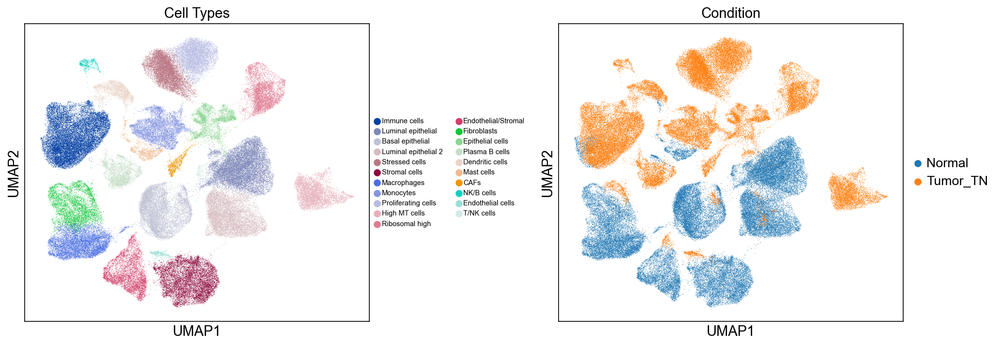

# Breast Cancer scRNA-seq Analysis: Triple Negative vs Normal

A breast cancer tumor is made of many cell types, including the actual cancer cells, 
immune cells attempting to fight the cancer, fibroblasts recruited by the cancer cells, 
blood vessel cells providing nutrients, and many others. This mix is known as the tumor 
microenvironment. This project uses single-cell RNA sequencing to determine what cell 
types exist in TNBC tumors, how many of each exist, which are unique to the tumor vs 
normal tissue, and what genes these cells are expressing.

TNBC is the most aggressive breast cancer subtype — these tumors lack estrogen 
receptors, progesterone receptors, and HER2 expression, making them untreatable with 
hormone or targeted therapies. Further understanding these tumors at the cellular level 
has direct clinical relevance.



## Dataset
GSE161529 (GEO) — 117,232 cells from 13 normal and 8 TNBC tumor samples  
Wu, S.Z. et al. A single-cell and spatially resolved atlas of human breast cancers. 
Nature Genetics, 2021. https://doi.org/10.1038/s41588-021-00911-1

## Key Findings

Several cell populations exist exclusively in tumor tissue. Proliferating cells 
(6,271 cells) reflect the cancer's hallmark of uncontrolled cell division. Stressed 
cells (8,333 cells) suggest the tumor has a hypoxic core due to rapid growth outpacing 
blood supply. CAFs (908 cells) are fibroblasts reprogrammed to support tumor growth.

97% of luminal and basal epithelial cells are found in normal tissue, representing 
healthy breast tissue architecture that is largely replaced in TNBC. The shift from 
99.8% normal macrophages to 99.1% tumor monocytes suggests a change in myeloid cell 
states between normal and tumor microenvironments.

## Notebooks
- `01_data_processing.ipynb` — data download, QC, normalization, clustering, annotation
- `02_analysis.ipynb` — visualization, cell type comparison, biological interpretation

## Setup
```bash
conda env create -f environment.yml
conda activate scrna-cancer
jupyter notebook
```
Raw data must be downloaded from GEO before running 01_data_processing.ipynb:
https://www.ncbi.nlm.nih.gov/geo/query/acc.cgi?acc=GSE161529

## AI Usage
This project was completed with assistance from Claude (Anthropic) for code guidance, 
debugging, and biological interpretation. All analysis decisions, written interpretations, 
and biological reasoning were developed through my own understanding of the material. 
Claude was used as a learning tool, not to generate results I didn't understand.

## Tools
- Python 3.10, Scanpy 1.11.5
- igraph + leidenalg (Leiden clustering)
- gseapy (pathway analysis)